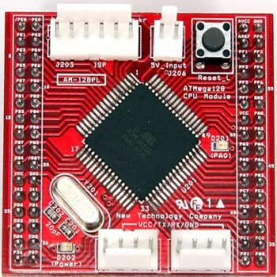
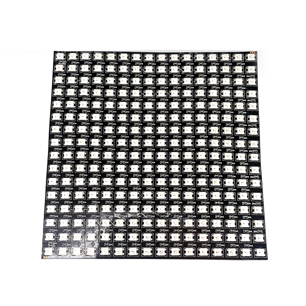
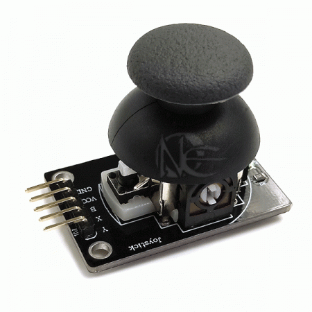
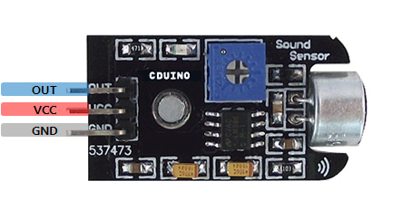

# AVR-Neopixel-Equalizer
Neopixel ws2812 ledpanel + atmega128 + joystick + MIC sensor 
atmega128보드 ,네오픽셀(ws2812), 사운드 센서를 이용한 이퀄라이저

# FUSEBIT
EXTENDED : 0xFF 
HIGH     : 0xC9 
LOW      : 0xEF 

Ext.16MHz Crystal,16MHz,4ms

# CIRCUIT
|Atmega128|Part Pin|Part|
|:------:|:----:|:----:|
|PF1|OUT|Sound Sensor(analog)|
|PF3|Y|Joystick y axis|
|PF4|X|Joystick x axis|
|PD0|B|Joystick button|
|PB2|Di|Neopixel 16x16|

# Parts
* [Atmega128 Development Board](http://www.newtc.co.kr/dpshop/shop/item.php?it_id=1314599855)

* [Neopixel](http://www.devicemart.co.kr/goods/view?no=1328622)

* [Joystick](http://www.devicemart.co.kr/goods/view?no=10916338)

* [Sound sensor](http://www.devicemart.co.kr/goods/view?no=28451)

# CODE
## python
|File||
|:------:|:----:|
|font.py|밝기숫자를 배열데이터로 생성 (making brightness number data)|
|rgb generator.py|16x16 픽셀의 png이미지를 배열데이터로 생성 (Convert 16x16 pixel png to array data)|
